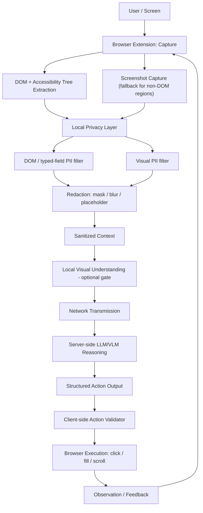

# On-Device Visual Perception for Lightweight Browser Agents

**Smart India Hackathon 2026 · Problem Statement 26171 · Organization: ISRO · Theme: Smart Automation**

> **Project status:** Documentation and design phase (Phases 0–1) complete.
> No extension, server, or evaluation code has been written yet. Everything
> described below is a design or a research-derived hypothesis awaiting
> implementation and measurement.

---

## Overview

This project is a browser-native, privacy-first agent that perceives a web page
on the user's device, removes sensitive information locally, and only then
asks a server-side reasoning model what to do next.

It is a **single agent with explicit modules**, not a multi-agent system and not
a generic "AI controls your browser" demo:

```
Perception → Privacy → Reasoning → Action Planning → Action Validation → Execution → Observation
```

The core guarantee is a strict privacy boundary: **raw sensitive data never
leaves the client.** The client is the enforcement point. The server is never
trusted to discard, ignore, or self-police anything it receives.

## Problem Statement

The agent must:

1. Read and understand the screen on-device.
2. Detect and sanitize personally identifiable information (PII) locally,
   before any network request.
3. Send only anonymized, sanitized context to a server-side reasoning model.
4. Execute the structured actions the model returns, balancing latency against
   accuracy.

> **Note:** The verbatim official PS 26171 text has not yet been supplied to
> this repository. The statement above is a restatement drawn from a
> paraphrase in the research document (§2). It must be confirmed against the
> official portal before `docs/PROBLEM_STATEMENT.md` is finalized.

## Key Design Ideas

| Idea | What it means |
|---|---|
| **DOM-first perception** | DOM and accessibility-tree metadata is the primary, zero-inference-cost signal. Vision models are a gated fallback for regions the DOM cannot describe (e.g. canvas). |
| **Structured metadata by default** | The default payload to the server is a structured description (roles, bounding boxes, type placeholders such as `[EMAIL]`) rather than pixels. Sanitized screenshots are sent only for non-DOM regions. |
| **Irreversible redaction** | Masking, blurring, or placeholder substitution only. No reversible or recoverable schemes. |
| **Fail closed** | If the privacy layer is uncertain or fails, nothing is sent. |
| **Over-redaction bias** | When precision and recall trade off, the pipeline prefers recall. |
| **Mandatory action validation** | Every server-returned action is checked by a client-side validator against the live page before execution. |
| **Selector-based actions** | Actions target DOM selectors. Raw coordinates are a fallback for canvas regions only. |

## Architecture



**Client (browser extension):** capture, DOM extraction, privacy filtering,
redaction, sanitized-context assembly, action validation, action execution.

**Server:** reasoning only. Receives sanitized context and returns a structured
action. It never executes actions and is never treated as trusted.

**Never leaves the device:** raw pixels of sensitive regions, raw values of
password/financial/government-ID/biometric fields, unblurred faces, and local
model weights and activations.

## Evaluation Criteria

The weights below are fixed by the problem statement and are not reinterpreted.

| Criterion | Weight |
|---|---|
| Visual context accuracy | 25% |
| PII precision / recall | 20% |
| Redaction precision | 20% |
| Client resource utilization | 20% |
| End-to-end latency | 15% |

65% of the score depends on what the model sees and what is hidden, so the
project prioritizes a slow-but-correct redaction pipeline over a fast-but-leaky
one.

## Novelty Claim

The defensible contribution is the **combination and its measurement**, not any
single technique:

1. A measured benchmark of DOM-gated versus unconditional vision-model
   invocation for privacy filtering.
2. Structured sanitized metadata as the default transmission mode instead of
   always sending a sanitized screenshot.
3. A working client-side action validator tested against a self-crafted page
   containing DOM-hidden prompt-injection instructions.

This project does not claim to be the first browser AI agent, the first
privacy-preserving browser agent, or the first on-device vision system.

## Current Status

| Area | State |
|---|---|
| Documentation and repository foundation | Complete (Phases 0–1) |
| Extension code | Not started |
| Server code | Not started |
| Tests and benchmarks | Not started |
| Models and dependencies | Not yet selected |

No component has been validated. Nothing in this repository should be read as
working software. Numbers labeled `[DESIGN ESTIMATE]` in the docs are
illustrative and must not be presented as measured results.

## Repository Structure

```
.
├── README.md
├── AGENTS.md
├── SIH_26171_RESEARCH_AND_EVIDENCE_DOCUMENT.md
└── docs/
    ├── MASTER_CONTEXT.md              # Hub document: start here
    ├── PROBLEM_STATEMENT.md
    ├── SYSTEM_ARCHITECTURE.md
    ├── PRIVACY_ARCHITECTURE.md
    ├── THREAT_MODEL.md
    ├── PII_DETECTION.md
    ├── REDACTION_PIPELINE.md
    ├── DOM_PERCEPTION.md
    ├── VISION_PIPELINE.md
    ├── SANITIZED_CONTEXT_PROTOCOL.md
    ├── ACTION_PROTOCOL.md
    ├── ACTION_VALIDATOR.md
    ├── PROMPT_INJECTION_DEFENSE.md
    ├── LATENCY_AND_RESOURCE_MODEL.md
    ├── EVALUATION_PLAN.md
    ├── EXPERIMENT_PLAN.md
    ├── SYNTHETIC_DATASET_PLAN.md
    ├── FALLBACK_STRATEGY.md
    └── IMPLEMENTATION_ROADMAP.md
```

The `extension/`, `server/`, `evaluation/`, and `tests/` directories will be
created from Phase 2 onward, once there is code to put in them.

## Where to Start

1. [`docs/MASTER_CONTEXT.md`](docs/MASTER_CONTEXT.md): project identity,
   decisions, constraints, and open questions.
2. [`docs/PRIVACY_ARCHITECTURE.md`](docs/PRIVACY_ARCHITECTURE.md): the privacy
   invariant and the client/server boundary.
3. [`docs/IMPLEMENTATION_ROADMAP.md`](docs/IMPLEMENTATION_ROADMAP.md): the
   phased plan and the target demo scenario.

## Evidence Base

Technical documents in `docs/` cite the research document by section (e.g.
`§17`) and by evidence tag:

| Tag | Meaning |
|---|---|
| `[A]` | Direct evidence from a verified 2021+ peer-reviewed paper |
| `[B]` | Official browser, framework, or model documentation |
| `[C]` | Engineering inference, not itself proven by a paper |
| `[D]` | Project design decision |
| `[E]` | Requires an experiment in our own prototype |
| `[F]` | Research gap: literature limited, contradictory, or absent |

The evidence base is deliberately small (six rows rather than the originally
targeted 25–50) because the field is younger than journal publication cycles.
This is reported as a finding, not hidden.

## Known Limitations

- No claim of complete PII detection or zero data leakage is made.
  Over-redaction is the deliberate compensating strategy.
- DOM-first perception is a reasoned choice, not a proven optimum. It requires
  its own validation experiment, and is untested on canvas- or Shadow-DOM-heavy
  interfaces.
- No public dataset covers browser agents, PII, and redaction jointly, so a
  self-collected synthetic dataset is required.
- No journal evidence yet exists of a small VLM running in-browser via WebGPU.

## Out of Scope (MVP)

OCR (unless the demo needs document or ID-photo upload flows), reversible
redaction, cross-tab and cross-session privacy state tracking, extension
supply-chain and self-integrity protection, and multi-agent orchestration.

## Technical Constraints

- Chrome is the primary target; Firefox is best-effort via a WASM fallback.
- Manifest V3 limits background logic to service workers, and offscreen
  documents may be needed for some capture APIs. This must be confirmed early.

## Open Questions

1. Confirm the exact official PS 26171 wording against the SIH portal.
2. Decide the demo scenario and target site(s) for the synthetic test pages,
   which determines whether OCR is in scope.
3. Select the server-side open-weight VLM.
