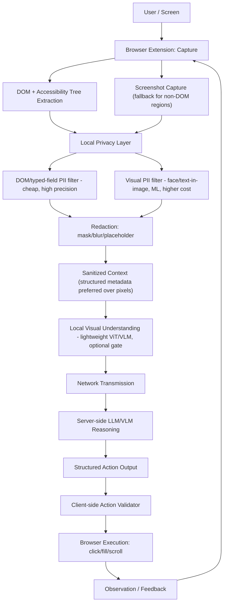

# MASTER CONTEXT — SIH 26171

Hub document. Read this first; every other doc in `docs/` expands one section
of this one.

## Project identity

A browser-native, privacy-first perception-and-action agent. Not a generic
"AI controls your browser" demo. Not a multi-agent system. One agent with
explicit modules: Perception → Privacy → Reasoning → Action Planning → Action
Validation → Execution → Observation.

## Problem statement (as currently known)

See `docs/PROBLEM_STATEMENT.md`. In short: the agent reads the screen
on-device, sanitizes/redacts PII locally before any network request, sends
only anonymized sanitized context to a server-side reasoning model, and
executes the structured actions that model returns, balancing latency against
accuracy. **The verbatim official PS text has not been supplied to this
repo** — the restatement above is drawn from the research document's §2
paraphrase, which is quoted, not the PS document itself. This is an open item
(see "Open questions" below).

## Target architecture

Source: research doc §40–41. Every block is a `[D]` design decision except
block H's cost (`[A]`, Row 1 — in-browser inference is measurably slower than
native) and block L's necessity (`[A]`, Row 4 — 94.4% prompt-injection
success rate against commercial LLMs in an agentic setting). The one thing
explicitly **not proven**, and the single most important early experiment: whether
gating block H behind blocks C/E1 (DOM-first) actually reduces end-to-end
latency and/or improves PII recall versus running vision unconditionally.

## System boundaries

- **Client (browser extension):** capture, DOM extraction, privacy filtering,
  redaction, sanitized-context assembly, action validation, action execution.
  This is the enforcement point — see `docs/PRIVACY_ARCHITECTURE.md`.
- **Server:** reasoning only. Receives sanitized context, returns a
  structured action. Never executes actions itself, never receives raw
  sensitive data intentionally, never treated as trusted to self-police.

## Privacy boundary

Raw sensitive data — passwords, emails, phone numbers, card numbers,
government IDs, unredacted faces — never leaves the client. Full detail:
`docs/PRIVACY_ARCHITECTURE.md`, `docs/THREAT_MODEL.md`.

## Evaluation criteria (fixed, do not reinterpret)

| Criterion | Weight |
|---|---|
| Visual context accuracy | 25% |
| PII precision/recall | 20% |
| Redaction precision | 20% |
| Client resource utilization | 20% |
| End-to-end latency | 15% |

65% of the score is "what the model sees and hides." Prioritize accordingly —
a slow-but-correct redaction pipeline beats a fast-but-leaky one. Full detail:
`docs/EVALUATION_PLAN.md`.

## Evidence tags (used throughout `docs/`)

| Tag | Meaning |
|---|---|
| `[A]` | Direct research evidence — verified 2021+ peer-reviewed journal paper |
| `[B][TECH-DOC]` | Official browser/framework/model documentation |
| `[C]` | Reasonable engineering inference from evidence, not itself proven by a paper |
| `[D]` | Project design decision (our choice) |
| `[E]` | Requires experiment/benchmark in our own prototype |
| `[F]` | Research gap — literature limited, contradictory, or absent |
| `[DESIGN ESTIMATE]` | An illustrative number, explicitly not measured — never present to judges as measured data |

## Research-backed decisions (summary — see linked docs for full reasoning)

- Irreversible redaction only, never reversible/recoverable schemes (`[A]`,
  research doc §26, Rows 2–3) → `docs/REDACTION_PIPELINE.md`
- Client-side action validator is mandatory, not optional (`[A]`, Row 4) →
  `docs/ACTION_VALIDATOR.md`
- DOM/ARIA metadata is the primary, zero-inference-cost perception signal;
  vision is fallback/supplement (`[B]`+`[D]`, §17–20) →
  `docs/DOM_PERCEPTION.md`, `docs/VISION_PIPELINE.md`
- Structured sanitized metadata is the default transmission mode, pixels only
  when DOM can't describe a region (`[D]`, §29, §45.2) →
  `docs/SANITIZED_CONTEXT_PROTOCOL.md`
- In-browser ML inference carries a real, large, device-variable cost (`[A]`,
  Row 1: 16.9×–30.6× average slowdown vs. native) → keep on-device models
  small and gated → `docs/LATENCY_AND_RESOURCE_MODEL.md`

## Engineering decisions not directly evidence-backed (labeled `[D]`/`[C]`)

- Over-redaction bias (prefer recall over precision when the two trade off) —
  `docs/PII_DETECTION.md`
- DOM-selector actions primary, raw coordinates fallback only for canvas
  regions — `docs/ACTION_PROTOCOL.md`
- WASM as the default runtime, WebGPU opportunistic (feature-detected
  upgrade) — `docs/VISION_PIPELINE.md`
- INT8 quantization mandatory for any on-device model above a few million
  parameters — `docs/LATENCY_AND_RESOURCE_MODEL.md`

## Known uncertainties / research gaps (`[F]`)

- No journal evidence quantifies the DOM-gated-vs-unconditional-vision
  latency/accuracy trade-off — this repo's own benchmark is the contribution.
- No journal evidence of a small VLM actually running in-browser via WebGPU.
- No public dataset purpose-built for "browser-agent + PII + redaction"
  jointly — a self-collected synthetic set is required.
- Whether DOM extraction meaningfully reduces vision workload is untested for
  privacy filtering specifically (real for standard HTML, unproven for
  canvas/Shadow-DOM-heavy UIs).

## Current implementation status

**Phase 0–1: complete (documentation and repository foundation).**
**Phase 2 onward: not started.** No extension code, no server code, no tests,
no benchmarks exist yet. Nothing in this repo should be read as "working."

## Validated components

None. Nothing has been implemented or tested yet.

## Unvalidated components

Everything described in `docs/` is a design decision or a research-derived
hypothesis pending implementation and measurement (see
`docs/EXPERIMENT_PLAN.md`).

## Dependencies

None chosen yet. `docs/TECHNOLOGY_DECISIONS.md` will be created in Phase 2
when a real dependency needs justifying (per `AGENTS.md` §5). Candidate
technologies discussed in the research document (not yet committed to):
Transformers.js / ONNX Runtime Web, Manifest V3 extension architecture. See
`docs/VISION_PIPELINE.md`.

## Model decisions

Not yet made. Candidate classes only (MobileViT/EfficientViT-class for
vision, SmolVLM-class as an experimental stretch) — see
`docs/VISION_PIPELINE.md`. No model has been downloaded, run, or benchmarked.

## Important constraints

- Chrome primary target, Firefox best-effort via WASM fallback (`[TECH-DOC]`,
  research doc §42 technology matrix).
- Manifest V3 restricts persistent background scripts to service workers;
  offscreen documents likely needed for some capture APIs — must be
  confirmed early (§42).
- Single agent, explicit modules — no multi-agent orchestration framework.

## Known limitations (disclosed, not hidden)

- The core evidence base is thin (6 rows, not the originally targeted
  25–50) because the field is younger than journal publication cycles
  (research doc §48). This should be presented to judges as a finding, not
  apologized for (§7b, §44).
- No claim of complete PII detection or zero data leakage is or will be made
  — over-redaction is the deliberate compensating strategy (§27, §52).
- The DOM-first strategy is a reasoned design choice, not proven optimal —
  it requires its own validation experiment (§41, §46).

## Novelty hypothesis (do not overclaim beyond this)

Per research doc §45, the defensible novelty is in the **combination and
measurement**, not any individual technique:
1. A measured (not assumed) benchmark of DOM-gated vs. unconditional
   vision-model invocation for privacy filtering.
2. Structured sanitized metadata as the default transmission mode instead of
   always sending a sanitized screenshot.
3. A working client-side action validator specifically tested against a
   self-crafted DOM-hidden-instruction injection page.

Do **not** claim "first browser AI agent," "first privacy-preserving browser
agent," or "first on-device vision system."

## Demo objective

Show the architecture, not just "AI clicked a button": raw local state → local
privacy filter → sanitized context → server reasoning → action validator →
execution, with a visible debug panel and a page that contains a hidden
prompt-injection attempt that gets correctly rejected. Full scenario:
`docs/IMPLEMENTATION_ROADMAP.md` (Phase 17) once reached.

## Do Not Do

- Do not build OCR into the MVP unless the demo scenario requires
  document/ID-photo upload flows (`[D]`, §17, §25, §46).
- Do not build reversible/recoverable redaction (`[A]`, §26).
- Do not build cross-tab/cross-session privacy state tracking (out of scope
  for a hackathon MVP).
- Do not attempt extension supply-chain/self-integrity protection — flagged
  as unsolved and explicitly out of scope, not silently ignored (`[F]`, §28).
- Do not build a multi-agent orchestration framework.
- Do not use raw pixel coordinates for actions except as a fallback for
  canvas regions with no DOM selector.
- Do not let a server-returned action execute without client-side validation.
- Do not present `[DESIGN ESTIMATE]` numbers as measured results to judges.

## Open questions (must be resolved before Phase 2 design is final)

1. The official SIH 26171 PS text is not verbatim in this repo — confirm
   exact wording against the official portal before finalizing
   `docs/PROBLEM_STATEMENT.md`.
2. Exact demo scenario / target site(s) for the synthetic test pages — not
   yet decided (affects whether OCR is in scope).
3. Server-side model choice — PS reportedly allows any offline-deployable
   open-weight VLM; not yet selected, out of scope for this documentation
   pass (research doc §42 explicitly defers this to the team).
