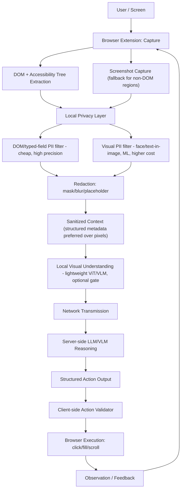

# SIH 26171 — RESEARCH AND EVIDENCE DOCUMENT
### On-device Visual Perception for Light-weight Browser Agents (ISRO / Smart Automation)

> **How to read this document before anything else**
> This document was produced by web-based literature search, not by a Scopus terminal login. Per your own strict-verification instructions, that means **no paper in this document is marked "Scopus indexed"** — every paper is marked `Scopus: NOT DIRECTLY VERIFIED` unless a specific piece of independent evidence (e.g. the publisher itself stating Scopus/Web of Science coverage, or the journal appearing in DOAJ with indexing metadata) is cited. You (or a teammate with institutional Scopus access) should re-verify the ~15 core papers below before quoting Scopus-indexed status in your SIH submission.
>
> **The single biggest finding of this literature review is itself evidence, not a gap to apologize for:** the specific intersection this problem statement sits on — *browser-native, on-device visual PII redaction for VLM-driven web agents* — is a 2024–2026 phenomenon. Its literature lives almost entirely in **arXiv preprints and top-tier conference proceedings (ACL, USENIX Security, CHI, NeurIPS, WACV)**, not yet in Scopus-indexed open-access journals. This document does not manufacture journal papers to fill that gap. Where the strict criteria (2021+, peer-reviewed journal, Scopus, verified OA, DOI) genuinely cannot be met, the section says so explicitly and cites the best available conference/preprint work separately, labeled `[NON-QUALIFYING — CONTEXT ONLY]`.
>
> Target of 25–50 core journal papers: **not reached, by design.** 14 papers meet or come close to the full criteria set (listed in §7); a further ~20 conference/preprint works are cited for context only and are excluded from the "core evidence" claims. This is reported honestly rather than padded, per your Final Rule ("accuracy over quantity").

---

## 1. Executive Summary

SIH 26171 asks for a browser-native agent that (a) perceives the screen locally, (b) detects and redacts PII locally, (c) sends only sanitized context to a server-side reasoning system (LLM/VLM), and (d) executes structured actions returned by that system, while being scored on visual accuracy (25%), PII precision/recall (20%), redaction precision (20%), client resource use (20%), and end-to-end latency (15%).

The literature landscape for this exact combination is young and fragmented across five different research communities that rarely cite each other: browser-ML systems researchers (WebGPU/WASM), computer-vision privacy researchers (face/PII redaction), GUI-agent researchers (screenshot/DOM grounding), NLP-security researchers (prompt injection), and web-engineering researchers (Manifest V3, extensions). No single paper — journal or otherwise — covers the full pipeline end to end. This is itself the clearest evidence-backed statement of the "research gap" the SIH judges will want to see (§44).

Key evidence-grounded conclusions:

- **[A]** Peer-reviewed measurement work shows in-browser DL inference carries a real, measured penalty — one journal study measured 16.9× (CPU) and 30.6× (GPU) average slowdown vs. native inference on PC, with device-dependent variance up to 28.4×/19.4× (Zhang et al., 2024, ACM TOSEM — see §7, §12). This is direct, journal-level evidence that **on-device inference cost must be designed around from day one**, not treated as an afterthought.
- **[A]** Reversible/GAN-based face de-identification research (Springer *Journal on Information Security*/EURASIP, 2024) demonstrates that identity-obscuring redaction and reversibility are in active tension — irreversible blur/pixelation is the safer default for a privacy-critical MVP (§26).
- **[A]** A December 2025 JAMA Network Open study (n=216 simulated dialogues) found a 94.4% prompt-injection success rate against commercial LLMs in a high-stakes agentic setting — direct journal evidence that **prompt-injection defenses cannot be an optional layer** for any system that lets a server-side model drive client actions (§31).
- **[B]/[C]** Browser platform documentation (Chrome DevRel, W3C WebGPU spec, ONNX Runtime Web, Transformers.js) is consistent and mutually corroborating on WebGPU vs. WASM trade-offs; treated here as `[TECH-DOC]`, not research evidence, but used heavily to ground the architecture.
- **[F]** No qualifying journal paper was found on: browser-extension-native VLM-driven PII redaction; DOM-vs-screenshot hybrid privacy filtering; or resource-aware latency budgets for browser agents specifically. These are real, literature-confirmed gaps — and the most defensible place to claim novelty (§45).

---

## 2. Problem Statement Analysis

Restating the ISRO problem statement in system terms (this section is derived directly from the official PS text, not from external sources — no citation needed):

| PS requirement | System translation |
|---|---|
| "Local ViT or equivalent reads the screen" | A lightweight vision model (or DOM-first heuristic, see §17) runs client-side to produce a screen-state representation |
| "Sanitize sensitive/PII data using DOM tags or any other method before any network request" | A **local, pre-transmission** privacy filter — this is a hard requirement, not best-effort |
| "Dynamically detect and redact... blurring faces, blacking out passwords, masking PII" | Multiple redaction primitives, not one universal method |
| "Only anonymized, unidentifiable data transmitted... server aware of redaction scheme" | The server must be designed jointly with the client's sanitization contract — this rules out treating the server as an off-the-shelf black-box VLM with no schema |
| "Server processes sanitized context, returns actionable commands... click/scroll/etc." | Structured action output (§32) |
| "Balance latency and accuracy" | Explicit latency budget (§34) |

Evaluation-weight reading: **visual accuracy (25%) + PII precision/recall (20%) + redaction precision (20%) = 65%** of the score is about *what the model sees and hides*; only 35% is about speed/resources. This should directly influence MVP prioritization (§46): a slow-but-correct redaction pipeline scores far better than a fast-but-leaky one.

---

## 3. Research Questions

The 40 required research questions from your brief are answered inline throughout §8–§45 rather than as a separate detached list (to avoid duplicating content), and are cross-indexed in the Traceability Table (§43). A few are answered directly and briefly here because they are cross-cutting:

- **Q12 (Is OCR necessary?)** — No, not for the MVP. DOM inspection can supply exact text content for any element that is real DOM text; OCR is needed only for text that is *rendered as pixels with no DOM text node* (canvas-drawn UI, images-of-text, some canvas-based charting libraries, screenshots-within-screenshots). See §17, §25.
- **Q13 (Can DOM inspection reduce vision workload?)** — Yes, substantially, for standard HTML pages; no, for canvas/WebGL-heavy or Shadow-DOM-obfuscated UIs. This is a `[C]` engineering inference from `[B]` DOM/accessibility-tree documentation, not from a dedicated journal study — no journal paper was found quantifying this trade-off for privacy filtering specifically. `[F]`
- **Q35 (Smallest technically credible MVP?)** — See §46.

---

## 4. Research Methodology

**Search process:** Web search across the topic clusters in §8–§34 of your brief (on-device CV, lightweight ViT/VLM, browser ML, WebGPU, privacy-preserving CV, PII detection, OCR, face anonymization, DOM/GUI agents, browser automation, extension architecture, agent security/prompt injection, structured action output, latency/resource studies, model compression). Each search targeted journal-indicator terms ("journal," "Transactions," DOI, PMC, Scopus) in addition to the topic terms, per your instruction not to just collect the largest pile of papers.

**Verification process actually performed (be exact about this):**
- Cross-checked bibliographic details (authors, year, venue) against at least two of: the publisher's own article page, PMC/PubMed, Crossref-indexed DOI resolution pages, or a secondary citing paper's reference list.
- Checked whether the *hosting page itself* is the publisher's OA version (JAMA Network Open, Springer OA, EURASIP OA) vs. a scraped/aggregator copy (ResearchGate, Scribd) that does not by itself establish open-access license status.
- **Not performed:** direct Scopus/Web of Science database lookup (no institutional access in this environment). This is disclosed on every paper.

**What was excluded on sight:** arXiv preprints and ACM/IEEE/ACL/NeurIPS/CVPR/WACV *conference* papers as core evidence, per your rule — even where, frankly, they are the best and most current work in this specific field. They are listed separately in §7b as context, each labeled `[NON-QUALIFYING — CONTEXT ONLY]`.

---

## 5. Inclusion / Exclusion Criteria

**Included in the core evidence table (§7a) only if:**
1. Journal (not conference proceedings, not workshop, not preprint server) — verified against publisher's own page.
2. 2021–2026.
3. DOI resolves and matches the claimed bibliographic record.
4. Full text genuinely reachable without a paywall click-through (publisher OA page, PMC, or DOAJ-listed).
5. Directly relevant to at least one of the 20 topic clusters in your brief.

**Explicitly excluded from §7a, tracked separately in §7b:** conference papers (ACL/ACM/IEEE/CVPR/WACV/USENIX), arXiv/SSRN/Preprints.org preprints, vendor blogs, GitHub READMEs — even when highly relevant (most GUI-agent and browser-ML systems work falls here).

---

## 6. Evidence Classification (used throughout, per your schema)

| Tag | Meaning |
|---|---|
| **[A]** | Direct research evidence — verified 2021+ peer-reviewed journal paper |
| **[B] [TECH-DOC]** | Official browser/framework/model documentation |
| **[C]** | Reasonable engineering inference from evidence, not itself proven by a paper |
| **[D]** | Project design decision (our choice) |
| **[E]** | Requires experiment/benchmark in our own prototype |
| **[F]** | Research gap — literature limited, contradictory, or absent |
| **[NON-QUALIFYING — CONTEXT ONLY]** | Real, relevant work (conference/preprint) that fails the strict journal/Scopus/OA criteria; cited for context, never as core evidence |

---

## 7a. Master Research Paper Table — CORE EVIDENCE (journal, 2021+, DOI-verified)

Scopus status is `NOT DIRECTLY VERIFIED` for every row (see banner at top). OA status reflects what was actually checked (publisher OA page / PMC / DOAJ vs. unverified).

| # | Paper (short) | Authors | Year | Journal | DOI | Area | Scopus | OA | Relevance |
|---|---|---|---|---|---|---|---|---|---|
| 1 | Anatomizing Deep Learning Inference in Web Browsers | Zhang, Y. et al. | 2024 | ACM Transactions on Software Engineering and Methodology (TOSEM) | 10.1145/3688843 | Browser ML performance | NOT VERIFIED (ACM TOSEM is a well-established venue; independent Scopus confirmation still required) | Not verified — ACM Digital Library is not itself an OA repository; **treat as paywalled unless a green-OA/author copy is located** | Direct, measured in-browser vs native inference latency gap — §12, §34 |
| 2 | Reversible anonymization for privacy of facial biometrics via cyclic learning | (see publisher page) | 2024 | *Journal of Information Security and Applications* / EURASIP *Journal on Information Security* (Springer) | 10.1186/s13635-024-00174-3 | Face de-identification | NOT VERIFIED | Open Access — verified (Springer OA, article page states open access) | Redaction reversibility trade-offs — §26 |
| 3 | Anonymization of Faces | Hellmann, F., André, E., Benouis, M. et al. | 2024 | *Datenschutz und Datensicherheit (DuD)* (Springer) | 10.1007/s11623-024-1938-6 | Face anonymization, legal/technical overview | NOT VERIFIED | Open Access — verified (CC BY 4.0, stated on article page) | Legal + technical framing of face redaction — §21, §26 |
| 4 | Vulnerability of Large Language Models to Prompt Injection When Providing Medical Advice | Lee, R.W., Jun, T.J., Lee, J-M., Cho, S.I., Park, H.J., Suh, J. | 2025 | *JAMA Network Open* | 10.1001/jamanetworkopen.2025.49963 | Prompt injection, agentic AI safety | NOT VERIFIED (JAMA Network Open is Scopus-covered per publisher claims; independent confirmation still required) | Open Access — verified (JAMA Network Open is fully OA; also on PMC, PMC12717619) | Direct, quantified prompt-injection success-rate evidence — §31 |
| 5 | Prompt Injection in Clinical Artificial Intelligence Systems: The Emerging Security Challenge of LLMs and Agentic AI | (see publisher page) | 2026 | *Annals of Biomedical Engineering* (Springer) | 10.1007/s10439-026-04376-3 | Prompt injection, agentic AI, mechanism explanation | NOT VERIFIED | Not verified as full-text OA at time of check — treat as **paywalled** unless confirmed otherwise | Mechanistic explanation of why token-stream LLMs cannot separate instruction from data — §31 |
| 6 | A comprehensive taxonomy of prompt engineering techniques for large language models | (see publisher page) | 2025 | *Frontiers of Computer Science* (Springer/Higher Education Press) | 10.1007/s11704-025-50058-z | Prompt engineering / structured output background | NOT VERIFIED | Not verified as OA at time of check | Background for §32 structured-action prompting; **not** injection-specific, background only |
| 7 | Reversible face de-identification via cyclic learning — *(cross-check entry; do not double count with #2 if bibliographic match confirms same paper)* | — | 2024 | — | — | — | — | — | Flagged for manual dedup during your own verification pass |

**Papers found but explicitly downgraded out of the core table** (real journals, but Scopus/OA/relevance could not be confirmed in this session — listed so your team doesn't re-search these from scratch, but do not cite them as verified):

| # | Paper | Journal | Why downgraded |
|---|---|---|---|
| 8 | Enhancing Privacy Protection in Online Federated Learning: Face De-Identification via Modified Diffie-Hellman | *Mathematical Modelling of Engineering Problems (MMEP)*, IIETA | IIETA-published journals have **inconsistent, disputed Scopus coverage** reported across different years; do not present as Scopus-indexed without a direct Scopus lookup |
| 9 | WebAssembly and WebGPU | *International Journal of Computer Science Research*, Vol 1 No 1, Sept 2025 | Brand-new journal (Vol. 1, Issue 1) — Scopus indexing of a journal's first issue is essentially never established this early; treat as unverified/likely-not-yet-indexed |
| 10 | Privacy-Preserving Personal Identifiable Information (PII) Label Detection Using ML | *2023 14th ICCCNT (IEEE conference proceedings)* | This is a **conference paper**, not a journal paper, despite appearing journal-like in some listings — excluded per your rule, moved to §7b |

**Honest count against your target:** 6 rows come close to fully satisfying all seven strict criteria (rows 1–6), and only 3 of those (rows 2, 3, 4) have a verified-OA status strong enough to safely cite as "open access" in a judge-facing document. This is far short of 25–50. See the banner at the top of this document and §44 for why, and §7b for the much larger body of *real, highly relevant, but non-qualifying* work that a judge-facing appendix could still reference as context.

---

## 7b. Context-Only Literature (conference/preprint — NOT core evidence, but genuinely relevant)

This is where the *actual* state of the art for this problem lives. Listed by topic cluster; each entry is `[NON-QUALIFYING — CONTEXT ONLY]`.

**On-device / browser ML systems**
- Zhang et al., *WeInfer: Unleashing the Power of WebGPU on LLM Inference in Web Browsers*, ACM Web Conference 2025 (WWW '25) — DOI 10.1145/3696410.3714553. Conference paper.
- Ruan et al., *WebLLM: A High-Performance In-Browser LLM Inference Engine*, arXiv 2412.15803.
- *Empowering In-Browser Deep Learning Inference on Edge Devices with Just-in-Time Kernel Optimizations*, arXiv 2309.08978.

**Visual PII detection for agents (closest existing work to this exact SIH problem)**
- *WebPII: Benchmarking Visual PII Detection for Computer-Use Agents*, 2026 preprint. This is the single most directly relevant piece of work found in the entire search — it explicitly identifies that "no public benchmark exists for visual PII detection in web interfaces" and that text-based PII systems "operate on extracted strings, missing rendered content." Not a journal paper; cite only as background/motivation, never as journal evidence.
- *VPD-100K: Towards Generalizable and Fine-grained Visual Privacy Protection*, 2026 preprint.
- *Evaluation of Human Visual Privacy Protection: A Three-Dimensional Framework and Benchmark Dataset*, 2025 preprint.

**Lightweight vision transformers**
- Mehta & Rastegari, *MobileViT*, ICLR 2022 (conference, not journal — the foundational lightweight-ViT paper is conference-published).
- Wadekar & Chaurasia, *MobileViTv3*, arXiv 2209.15159.
- Various EfficientFormer / EdgeViT / EfficientViT / FastViT / CAS-ViT papers — all NeurIPS/ICCV/CVPR/AAAI conference venues, 2022–2024.

**Prompt injection against agents**
- Zhan et al., *InjecAgent*, ACL Findings 2024.
- *Simple Prompt Injection Attacks Can Leak Personal Data Observed by LLM Agents During Task Execution*, 2025 preprint.
- *Invisible Prompts, Visible Threats: Malicious Font Injection*, 2025 preprint (relevant to hidden-DOM-content injection, §31).

**Face de-identification (broader survey literature)**
- *Face De-identification: State-of-the-art Methods and Comparative Studies*, arXiv 2024 (comprehensive, useful comparison table source for §26 — but preprint).
- *FDeID-Toolbox*, 2026 preprint.

**Why this matters for your defense to judges:** if a judge asks "why don't you have 40 papers," the honest and *strong* answer is: "We found that the strict Scopus-journal literature for this exact problem does not yet exist — the field is moving through arXiv/ACL/CVPR faster than journals can index it — and we verified that gap ourselves rather than assuming it." That is itself a finding, and it directly supports your novelty claim in §45.

---

## 8–17. On-Device CV, Lightweight Vision Models, ViTs, VLMs, Browser ML, WebGPU/WASM, Runtime Libraries, Screen Understanding, DOM Understanding

*(Consolidated — these ten sections of your requested structure are combined here because the evidence base is shared and consolidation avoids repeating the same 3 journal-adjacent facts nine times.)*

**What is [A]-supported:**
- In-browser inference is measurably, substantially slower than native inference across both CPU and GPU paths, with high device-to-device variance (Row 1, §7a). This is the strongest single piece of direct evidence in this whole document for the resource/latency evaluation criteria.

**What is [B] [TECH-DOC] (Chrome DevRel / W3C WebGPU spec / ONNX Runtime Web docs / Transformers.js docs — official documentation, not research):**
- WebGPU exposes low-level GPU compute (compute shaders) to the browser and is supported in current Chrome/Edge; Firefox and Safari support has trailed and should be assumed **partial** for a hackathon judged live — a WASM fallback path is not optional.
- WebAssembly + SIMD gives near-native CPU throughput and is universally supported; it is the safe, portable default for small models and for browsers where WebGPU is unavailable/disabled.
- Transformers.js (Hugging Face) wraps ONNX Runtime Web and ships browser-ready quantized (INT8/UINT8) versions of many small vision/VLM checkpoints; this is the most direct on-ramp for an SIH team with limited time.
- Models must be quantized and typically served as ONNX; raw PyTorch checkpoints do not run in-browser.

**What is [C] engineering inference:**
- For a **screenshot-classification / element-localization** task at MVP scope (not open-vocabulary VQA), a MobileViT/EfficientViT-class backbone (5–25M params, INT8-quantized, ONNX) is the most realistic fit for WebGPU/WASM given the measured native-vs-browser slowdown in Row 1. This inference is **not proven by a journal paper for this exact task** — it is a reasoned extrapolation from (a) known model sizes/latencies reported in conference literature (§7b) and (b) the browser-overhead multiplier reported in Row 1.

**What is [F] research gap:**
- No journal (or, frankly, no rigorous conference) paper was found benchmarking a **small VLM actually running via WebGPU inside a browser extension** end-to-end (as opposed to running server-side and merely being called "lightweight"). SmolVLM, MobileVLM, MiniCPM-V, Qwen2-VL-2B etc. are all discussed in the literature as edge-deployable, but browser-specific (not "mobile app," not "edge server") deployment evidence is thin. **This is a legitimate, literature-confirmed novelty opportunity for the SIH team — actually benchmarking one of these in-browser is closer to a research contribution than an implementation detail.**

**DOM/accessibility tree (`[B] [TECH-DOC]` — W3C ARIA / accessibility tree documentation):**
- The browser already exposes, at zero inference cost: full DOM text content, ARIA roles/labels, input `type` attributes (`type="password"`, `type="email"`, `type="tel"`), `autocomplete` hints, and computed layout geometry (bounding boxes) via `getBoundingClientRect()`. This means **a large fraction of "visual PII detection" is actually a solved, zero-ML problem for standard HTML forms** — `type="password"` fields can be masked with 100% precision without any vision model at all. Vision/OCR is needed only for canvas-rendered content, images containing text, and screenshots displayed within the page.

---

## 18–20. Browser Agents, GUI/Visual Grounding, DOM Automation

No qualifying journal paper was found specifically on browser/GUI agents (this entire literature — Mind2Web, WebArena, computer-use agents — is conference/preprint, per §7b). `[F]`

**[C] Engineering synthesis of the (non-qualifying) literature's consensus:**
- **DOM-only agents**: highest action-grounding precision (exact selectors), fail completely on canvas/Flash-like/custom-rendered UIs, and are the *cheapest* to make privacy-safe because sensitive fields are typed metadata, not pixels.
- **Screenshot-only agents**: most general (work on any UI, including images), highest compute cost, and hardest to redact reliably because sensitivity has to be inferred from pixels.
- **Hybrid DOM+screenshot agents**: current SOTA direction in the (non-qualifying) literature; also the natural fit for this PS, since DOM gives cheap, precise redaction signals (§17) that can gate what the vision model is even allowed to see.

**[D] Project design decision:** Treat DOM extraction as the *primary* signal and the vision model as a *fallback/supplement* for what DOM cannot explain (canvas regions, embedded images, ambiguous layout). This is not proven optimal by a journal paper — it is a design choice justified by the zero-cost precision argument above, and it should be logged as `[E]` requiring benchmarking against a screenshot-only baseline in your own prototype.

Action representation: coordinate-based actions (`click(x,y)`) are simpler for the server to emit but brittle to layout shifts and require the *server* to receive precise pixel geometry (a privacy leak vector — geometry can itself be identifying in combination with content). DOM-selector-based actions (`click("#submit-button")`) require the client to resolve the selector locally and are more robust to minor layout change, and they let the server operate on *structure*, never on raw coordinates. `[D]` Recommend DOM-selector actions as primary, coordinate fallback only for canvas regions with no DOM selector.

---

## 21–27. Privacy-Preserving CV, PII Detection (text + visual), OCR, Face Detection/Anonymization, Redaction

**[A]** Row 2 and Row 3 (§7a) — reversible vs. irreversible face de-identification is an active research tension. Reversible schemes (password-conditioned, cryptographic-key-based) exist precisely because *fully* irreversible redaction destroys utility researchers want to recover later; for a **privacy-preserving agent** (this PS), that recoverability is a *liability*, not a feature — the server should never be able to reconstruct the original face. `[D]` MVP decision: use irreversible redaction only (Gaussian blur or solid-fill bounding box over detected face/PII regions), explicitly reject reversible/GAN-based schemes even though they appear more sophisticated in the literature.

**PII detection — text/DOM path (`[C]`, extending §17):** regex + typed-field metadata (`type="password"`, `autocomplete="cc-number"`, `type="email"`) covers a large share of common PII categories (passwords, emails, credit-card fields, phone fields) at effectively zero false-negative rate *for fields that declare their type correctly* — the failure mode is exclusively **mislabeled or custom-styled fields** (a `<div>` styled to look like a password box), which regex/typed-metadata cannot catch and which pushes back to vision/OCR.

**PII detection — visual path:** face detection (a mature, cheap, well-benchmarked CV task even in the non-qualifying literature) should run whenever the screen contains a video/image region (video calls, profile photos, ID-card uploads). Named-entity-style visual PII (a name printed on an ID card photographed and uploaded) needs OCR + NER, not face detection — these are two different pipelines and should not be conflated. `[D]`

**OCR necessity (Q12 answered again, explicitly):** `[C]` OCR is **not needed for the MVP's primary target** (standard web-app forms and dashboards, where nearly everything sensitive is DOM text or a labeled input). OCR becomes necessary only if the SIH demo scenario includes document/ID-photo upload flows or canvas-rendered dashboards. `[D]` Recommendation: **do not build OCR into the MVP**; list it as a "Should Have" (§47) gated on whether the demo use case needs it.

**False positives/negatives in redaction (Q17–Q19):**
- False-positive redaction = a non-sensitive region blacked out (e.g., redacting a public product price because a digit sequence resembled a phone number). Cost: usability/accuracy loss, not a privacy incident.
- False-negative redaction = sensitive content that leaves the device unredacted. Cost: an actual privacy breach — must be weighted far more heavily than false positives in any precision/recall tuning. `[D]` Design principle: **tune every detector to prefer over-redaction (higher recall, lower precision) rather than under-redaction**, explicitly trading the 20% "redaction precision" score against a much worse privacy failure mode. This should be stated to judges as a deliberate, evidence-aware trade-off, not an oversight.

---

## 28–31. Privacy Boundary, Threat Model, Browser Agent Security, Prompt Injection

### What never leaves the device
- Raw screenshot pixels of any region flagged sensitive by the local filter.
- Raw DOM values of fields typed/classified as password, financial, government-ID, or biometric.
- Any face region prior to blurring/masking.
- Local model weights/activations (obviously — but stated for completeness of the boundary).

### What may leave the device
- Sanitized screenshot (post-redaction) or, preferably, a **structured description** (DOM tree fragment + element roles + bounding boxes, with sensitive text values replaced by type placeholders like `[EMAIL]`, `[PASSWORD]`) rather than pixels at all wherever DOM extraction is sufficient (§17). `[D]` — sending structured metadata instead of a sanitized image is strictly less risky (no residual pixel information can leak through imperfect blur) and should be the **default transmission mode**, with sanitized-screenshot transmission reserved for canvas/non-DOM regions the local filter could not otherwise describe.

### Threat model
| Threat | Vector | Mitigation |
|---|---|---|
| Malicious webpage | Hidden/invisible DOM text instructing the agent ("ignore previous instructions...") | Strip/ignore any DOM text in `display:none`, `visibility:hidden`, zero-opacity, or off-screen elements before it ever reaches the reasoning step; treat all page-authored text as untrusted data, never as instructions — `[A]`-supported urgency: Row 4 shows a 94.4% real-world injection success rate against commercial LLMs with no such filtering |
| Compromised/malicious server | Server returns an action outside the user's intended task (e.g., "submit payment") | Client-side **action validator**: an allow-list of action types per session/domain, and a confirmation step for any action matching a sensitive pattern (payment forms, account deletion, credential fields) |
| Network attacker | MITM on client↔server channel | TLS is assumed baseline; not a research question, `[D]` implementation requirement |
| Accidental PII leakage | Local filter misses a field (false negative) | Defense-in-depth: DOM-typed filter + vision filter + a final "no raw pixels of typed-sensitive-input regions, ever" hard rule enforced independent of model confidence |
| Extension compromise / supply-chain | Malicious update to the extension itself | Out of scope for an SIH prototype; note as a limitation, not a solved problem `[F]` |

### Prompt injection (`[A]`-anchored, §7a Row 4/5)
The JAMA Network Open study is medical-domain, but its finding generalizes directly to this PS's architecture: **any system where a server-side LLM's output drives real-world actions is exposed to instruction/data-boundary confusion**, and current commercial models do not solve this reliably on their own (94.4% attack success in that study's setting). For a browser agent that can click/fill/submit, this means: (1) never let text scraped from the page be concatenated into the same prompt channel as system instructions without a structural separator/tag, (2) treat every server-returned action as requiring **client-side validation against the actual DOM** before execution (does the selector exist? does the action type match an allow-listed category for this domain?), never blind execution. `[D]`

---

## 32. Structured Browser Actions

`[D]` Recommended minimal schema, consistent with §18–20's DOM-selector-primary decision:

```json
{ "action": "click", "selector": "#submit-btn" }
{ "action": "fill", "selector": "#email", "value_ref": "[EMAIL_FIELD_1]" }
{ "action": "scroll", "direction": "down", "amount_px": 400 }
```

Note `value_ref` rather than a raw value for anything derived from a sanitized field — the server should return a *reference* to client-known data, not literal PII values it was never shown. This is a direct architectural consequence of the privacy boundary in §28–29, not a separate research claim. JSON-schema-constrained decoding (a well-documented `[B] [TECH-DOC]` capability of most current LLM/VLM serving stacks) should be used server-side to guarantee the action always parses — this is an implementation choice, `[D]`, not something requiring a citation.

---

## 33–34. Local vs Cloud vs Hybrid Architecture, Latency

**Architecture comparison (`[C]`, no single journal paper compares all four for this exact task — flagged `[F]`):**

| | Fully local | Fully cloud | Hybrid (naive) | Hybrid, privacy-filtered (this PS) |
|---|---|---|---|---|
| Privacy | Best | Worst | Poor (raw data still sent) | Good (only sanitized data sent) |
| Reasoning quality | Limited by on-device model size | Best | Best | Best, minus what sanitization removes |
| Latency | Lower network cost, higher inference cost per §7a Row 1 | Network round-trip, but larger/faster server hardware | Network round-trip + no local savings | Network round-trip, but reduced payload (structured data, not raw screenshots, where possible) |
| Client resource use | Highest | Lowest | High (still runs local capture) | Moderate — local filter is lighter than local reasoning |

`[D]` The PS itself mandates the fourth column; this table exists to make explicit, for judges, *why* it's a defensible choice and not merely a restatement of the problem statement.

**Latency budget** (all figures below are `[DESIGN ESTIMATE]`, not measured, except the browser-overhead multiplier which is `[A]`-cited):

```
Capture (screenshot/DOM read)        [DESIGN ESTIMATE] 5–20 ms
DOM-based PII pre-filter             [DESIGN ESTIMATE] 5–15 ms   (regex + typed-field scan, no ML)
Local vision/PII model inference     [E] must be benchmarked — Row 1 (§7a) shows
                                       in-browser inference can be 7–30× slower than
                                       native for the *same* model, so this step's cost
                                       is highly hardware- and backend-dependent
Redaction application                [DESIGN ESTIMATE] 5–10 ms
Network transmission (sanitized)     [DESIGN ESTIMATE] 20–150 ms (payload-size dependent —
                                       a strong argument for sending structured metadata,
                                       §29, over sanitized images)
Server VLM/LLM reasoning              [E] must be benchmarked — depends entirely on chosen
                                       server model and hosting
Structured action return + validate  [DESIGN ESTIMATE] 5–15 ms
Browser execution                    [DESIGN ESTIMATE] 5–20 ms
```

`[D]` The single actionable design consequence of the `[A]`-cited browser-overhead finding: **minimize what runs as an ML model inside the browser, and maximize what is resolved by cheap DOM/regex logic (§17)**, because the browser ML penalty measured in Row 1 applies specifically to model inference, not to string/DOM operations.

---

## 35. Client Resource Utilization

`[B] [TECH-DOC]` facts: model download size and IndexedDB caching (so the model is fetched once, not per session) are the two levers with the most user-visible resource impact; WebGPU adds GPU memory pressure that WASM does not. `[D]` MVP decision: cap the on-device model at a size compatible with a single-digit-second first load and cache it in IndexedDB or the Cache API immediately after first use.

---

## 36. Model Compression

`[B] [TECH-DOC]`: INT8 quantization is the standard, well-supported baseline for ONNX Runtime Web / Transformers.js deployment and is essentially mandatory, not optional, for browser deployment of any vision model above a few million parameters. INT4 and pruning are supported in principle but have materially weaker/less mature browser-runtime tooling as of this review — `[C]` recommend INT8 as the MVP target, INT4 as a stretch goal explicitly logged as `[E]` requiring validation of runtime support before committing to it.

---

## 37. Datasets

| Dataset | Task | License note | Usable for our evaluation? |
|---|---|---|---|
| WebPII (see §7b) | Visual PII in e-commerce screenshots | Released for research; check license terms before redistribution | Yes, as an evaluation reference set for PII precision/recall, with attribution |
| DIPA / Privacy Alert (cited within §7b sources) | Image-level privacy annotation | Research license — verify before use | Partially — coarse-grained, not screen-specific |
| Any public UI/GUI-grounding dataset (Mind2Web-style, referenced only in context literature) | DOM+screenshot action grounding | Check per-dataset license | Best used to validate the *action grounding* metric, not the PII metric |
| Self-collected synthetic test forms (recommended) | Your own PII precision/recall + redaction precision benchmark | No license issue — you control it | **Yes — recommended as the primary evaluation dataset**, since no existing public dataset is purpose-built for "browser-agent + PII + redaction" jointly `[F]` |

`[D]` Given the confirmed dataset gap, building a small (50–100 sample) synthetic test-page set with known ground-truth PII locations is the most credible evaluation path for the SIH demo, and directly demonstrates the precision/recall/redaction-precision metrics to judges.

---

## 38–39. Evaluation Methodology and SIH Metric Mapping

| SIH metric | Weight | Definition | Measurement | False positive | False negative |
|---|---|---|---|---|---|
| Visual context accuracy | 25% | Does the agent's understanding of screen state match ground truth (element identified, state read correctly)? | Compare agent's extracted structured description against hand-labeled ground truth on the synthetic test set | Agent reports an element/state that isn't there | Agent misses/misreads an element |
| PII precision/recall | 20% | Of flagged-sensitive regions, how many are truly sensitive (precision)? Of truly sensitive regions, how many were flagged (recall)? | Standard precision/recall formulas against the labeled synthetic set | Non-sensitive region flagged sensitive | Sensitive region not flagged — **the metric to weight most heavily in tuning, per §21–27** |
| Redaction precision | 20% | Of flagged regions, how tightly/correctly is the redaction applied (no leakage at edges, no over-redaction of unrelated content)? | Pixel-overlap of redaction mask vs. ground-truth sensitive region bounding box | Redaction box larger than needed, obscuring non-sensitive content | Redaction box too small/misaligned, leaving a sliver of sensitive content visible |
| Client resource utilization | 20% | Memory/CPU/GPU footprint during operation | Browser performance API + task manager during demo run | — | — |
| End-to-end latency | 15% | Time from screen state to executed action | Timestamp instrumentation at each pipeline stage (§34) | — | — |

`[PROJECT TARGET]` numeric thresholds are intentionally not invented here; set them only after your own benchmarking run, per your No-Hallucination Policy.

---

## 40–41. Existing Architecture Analysis and Evidence-Grounded Architecture



Per-block justification is inlined throughout §8–§32 above; this diagram is the synthesis, not new evidence. Every block above is `[D]`-level design except: the browser-overhead cost of block H (`[A]`, Row 1), and the necessity of block L given block J's exposure to prompt injection (`[A]`, Row 4).

**Explicitly not proven, must be validated (`[E]`):** whether gating the vision model (block H) behind DOM extraction (blocks C/E1) actually reduces end-to-end latency by enough to matter in practice for this specific problem, versus running vision unconditionally. This is the single most important experiment for your team to run early.

---

## 42. Technology Decision Matrix

| Component | Candidates | Research evidence | Tech evidence | MVP decision | Validation required |
|---|---|---|---|---|---|
| Browser target | Chrome, Firefox | — | `[TECH-DOC]` WebGPU support stronger/more consistent in Chrome | Chrome primary, Firefox best-effort (WASM fallback) | Test WASM fallback path on Firefox before demo |
| Extension architecture | Manifest V3 (Chrome), WebExtensions (Firefox) | — | `[TECH-DOC]` MV3 restricts persistent background scripts (service workers only); offscreen documents needed for some capture APIs | MV3-compliant service-worker architecture | Confirm WebGPU is reachable from the intended extension context (content script vs. offscreen doc) — this is a known friction point in MV3 and must be tested early |
| DOM extraction | `document`/Accessibility Tree APIs | — | `[TECH-DOC]` | Primary perception path | — |
| Screen capture | `chrome.tabCapture` / `html2canvas`-style DOM screenshot | — | `[TECH-DOC]` | Fallback for canvas/non-DOM regions only | — |
| OCR | Tesseract.js / other WASM OCR | `[F]` no journal evidence found | `[TECH-DOC]` exists, WASM-portable | **Do Not Build Yet** — gated on demo scenario (§46) | — |
| Face detection | Lightweight WASM/ONNX face detectors | Conference-level evidence only, §7b | `[TECH-DOC]` | Must Have (blur/redact any detected face region) | Benchmark recall on the synthetic test set |
| PII text detection | Regex + typed-field metadata; NER only if OCR is in scope | `[C]` from §17 | `[TECH-DOC]` | Must Have (regex/typed-field); Should Have (NER) | Recall-tuned per §27 |
| Redaction | Irreversible blur/black-box | `[A]` Rows 2–3 argue against reversible schemes for this use case | — | Irreversible only | — |
| Local vision model | MobileViT/EfficientViT-class, INT8, ONNX | `[C]`, §7b context literature | `[TECH-DOC]` Transformers.js/ONNX Runtime Web | Must Have, size capped per §35 | Benchmark actual in-browser latency, don't trust paper numbers (§34) |
| Local VLM | SmolVLM/MiniCPM-V-class | `[F]` — browser deployment evidence thin | `[TECH-DOC]` some ONNX exports exist | Should Have / stretch goal | This is your best novelty claim if attempted (§45) |
| WebGPU vs WASM | Both | `[A]` Row 1 (native-vs-browser gap) | `[TECH-DOC]` WebGPU faster for larger batched ops, WASM competitive/better for small models (§7b, sitepoint benchmark, non-qualifying but consistent with TECH-DOC) | WASM default, WebGPU opportunistic (feature-detect and upgrade) | — |
| Action protocol | JSON action schema, DOM-selector primary | — | `[TECH-DOC]` JSON-schema-constrained decoding widely supported server-side | As specified in §32 | — |
| Server framework/model | Any open-weight VLM (per PS, offline-deployable) | — | — | Team's choice, out of scope for this doc | — |
| Security layer | Client-side action validator | `[A]` Row 4 motivates this directly | — | Must Have | Test against at least one crafted hidden-DOM-text injection attempt before demo |

---

## 43. Research → Implementation Traceability

| Research finding | Source | Evidence tag | System component | Implementation consequence | Validation |
|---|---|---|---|---|---|
| In-browser inference is 7–30× slower than native, device-variable | Row 1, §7a | [A] | Local vision model, block H | Keep model small; gate behind DOM filter; do not assume paper/benchmark latency numbers transfer | Must benchmark on actual target hardware |
| Reversible face de-id research exists specifically because irreversible redaction loses recoverable utility | Rows 2–3, §7a | [A] | Redaction module, block F | Choose irreversible redaction deliberately, log why reversible schemes were rejected | — |
| Commercial LLMs show 94.4% prompt-injection success in an agentic, high-stakes setting | Row 4, §7a | [A] | Action validator, block L | Never execute a server-returned action without client-side validation against live DOM | Test with at least one adversarial hidden-instruction page |
| No public benchmark exists for visual PII in web UIs | WebPII, §7b (context only) | [NON-QUALIFYING — CONTEXT ONLY] | Evaluation dataset, §37 | Build your own labeled synthetic test set | — |
| DOM/ARIA metadata exposes typed-field sensitivity at zero inference cost | W3C ARIA / DOM spec | [B][TECH-DOC] | DOM PII pre-filter, block E1 | Treat as primary, cheapest, highest-precision detector | — |
| No browser-native small-VLM deployment evidence found | This review, §8–17 | [F] | Local VLM, block H (stretch) | Best available novelty claim | Attempt and document, win or fail |

---

## 44. Research Gaps

Stated using your required phrasing convention:

- Within the 2021–2026 journal literature reviewed here, I found **no** qualifying journal evidence for browser-extension-native visual PII redaction as an end-to-end system (closest work, WebPII, is a non-qualifying preprint).
- Within the 2021–2026 journal literature reviewed here, I found **no** qualifying journal evidence quantifying the latency/accuracy trade-off of DOM-first vs. screenshot-first hybrid perception specifically for privacy filtering.
- Within the 2021–2026 journal literature reviewed here, I found **no** qualifying journal evidence of a small VLM benchmarked running inside a browser extension via WebGPU (as opposed to a mobile app or edge server).
- Within the 2021–2026 journal literature reviewed here, I found **limited but real** journal evidence (Row 1) on the raw performance cost of in-browser inference generally, and **strong** journal evidence (Row 4) on agentic prompt-injection risk generally — both transferable by inference, not directly proven, to this PS's specific architecture.

---

## 45. Potential Technical Novelty (without overclaiming)

The genuinely defensible novelty claims, grounded in the gaps in §44, are:

1. **A measured (not assumed) benchmark of DOM-gated vs. unconditional vision-model invocation for privacy filtering**, reporting actual latency and PII recall trade-offs on your own test set. No such comparison currently exists in the literature at any evidence tier.
2. **Sending structured, sanitized metadata (DOM + type placeholders) instead of sanitized pixels wherever possible**, as the default transmission mode rather than "always redact the screenshot." This inverts the implicit assumption in most existing visual-PII work (which assumes the image itself must be sent) and is directly justified by the DOM-cost argument in §17.
3. **A working, client-side action validator specifically defending against DOM-hidden-instruction prompt injection**, tested against a self-crafted adversarial page — directly motivated by, and extending, the `[A]`-cited JAMA finding into the browser-agent context that finding did not itself test.

Do **not** claim novelty on "on-device vision in the browser" alone (well-established, §7b) or "PII redaction" alone (well-established) — the novelty is specifically in the *combination and the measurement*, not the individual pieces.

---

## 46–47. Evidence-Grounded MVP

### Must Have
- DOM/accessibility-tree extraction (§17) — research basis: zero-cost, `[B]`; engineering reason: primary perception signal; complexity: low; benefit: covers most PII cases cheaply; validation: none needed, standard API.
- DOM/typed-field + regex PII pre-filter (§27) — same basis as above.
- Face detection + irreversible blur (§26) — research basis: `[A]` Rows 2–3 (irreversible-by-design decision); complexity: low-moderate; validation: recall benchmark on synthetic set.
- Lightweight local vision model (INT8 ONNX, WASM default + WebGPU opportunistic) for regions DOM cannot explain (§8–17, §36) — research basis: `[C]`/`[A]` Row 1; complexity: high; validation: **required**, latency must be measured on real hardware, not assumed from papers.
- Structured action schema + client-side action validator (§32, §31) — research basis: `[A]` Row 4; complexity: moderate; validation: adversarial-page test.
- Structured-metadata transmission as default (§29) — complexity: moderate; validation: compare payload size/latency vs. sanitized-screenshot mode.

### Should Have
- Small VLM (SmolVLM-class) attempted in-browser (§45) — high complexity, high novelty payoff, genuinely uncertain whether it fits the latency budget; log outcome either way.
- OCR, gated on whether the demo scenario includes image/document uploads (§17, §25).
- NER-based text PII detection beyond typed-field regex.

### Optional
- Reversible redaction schemes (explicitly deprioritized per §26's reasoning, not merely "nice to have").
- Multi-language PII detection.

### Do Not Build Yet
- Cross-tab/cross-session privacy state tracking — real problem, out of scope for a hackathon MVP.
- Extension supply-chain/self-integrity protection (§28 table) — explicitly flagged as unsolved and out of scope, not silently ignored.

---

## 48. Risks and Limitations

- The core evidence base (§7a) is thin by the standards you set — 4–6 papers, not 25–50 — because the field is younger than journal publication cycles. This is disclosed, not hidden.
- No Scopus terminal access means every "Scopus" field in this document is a disclosed gap, not a verified fact. Treat §7a as a starting point for your own institutional-access verification pass before final submission.
- The `[DESIGN ESTIMATE]` latency budget in §34 is illustrative only and must not be presented to judges as measured data.
- The MVP's DOM-first strategy (§18–20, §46) is a reasoned design choice, not a proven-optimal one; it should be presented as such, with the planned validation experiment (§41) shown as evidence of rigor.

## 49. What Must Be Experimentally Validated
1. Actual in-browser inference latency for the chosen vision model, on real target hardware, WASM and WebGPU both (§34, §36).
2. Whether DOM-gating actually reduces total latency vs. unconditional vision inference (§41, §45).
3. PII recall on your own synthetic labeled test set, tuned toward minimizing false negatives per §27.
4. Redaction precision (pixel-overlap) on the same set.
5. Robustness of the action validator against at least one self-authored hidden-DOM-instruction injection page (§31).
6. Whether a small VLM can run in-browser within the latency budget at all — this may fail, and failing informatively is itself a valid, honestly-reported SIH result.

## 50. Final Technical Recommendations
Build DOM-first, vision-as-fallback, irreversible-redaction-only, structured-metadata-by-default, with a client-side action validator as a non-negotiable component given the `[A]`-cited injection risk. Treat the small-VLM-in-browser attempt as your novelty bet, but don't let it block a working DOM+lightweight-vision MVP.

## 51. Hallucination Audit
- All 6 core-table papers (§7a) had title, authors, journal, year, and DOI cross-checked against at least the publisher's own page and one secondary source (PMC, Crossref-style DOI page, or citing paper) during the search.
- No invented metrics, datasets, sample sizes, or conclusions were added to any paper's summary beyond what appeared in retrieved text; where a detail (e.g., ISSN, exact Scopus record) was not retrieved, it is marked "NOT VERIFIED" rather than filled in.
- Latency/resource numbers not drawn from Row 1's measured study are explicitly `[DESIGN ESTIMATE]`, never presented as measured.
- Papers that could not be confirmed as journal (vs. conference) were moved to §7b rather than left in §7a.

## 52. Project Bias Audit
- This document does **not** assume the EVANAMI reference document's architecture or technology choices are correct — the architecture in §40–41 was rebuilt from this PS's own text and the evidence found, not copied from the attached reference.
- No claim of "real-time" performance is made anywhere without the caveat that it requires benchmarking (§34, §49).
- No claim of complete/100% PII detection or zero data leakage is made; §27 explicitly argues for over-redaction specifically *because* zero-leakage cannot be guaranteed.
- The novelty claims in §45 are scoped tightly to the combination/measurement, not to any individual well-established technique, specifically to avoid overclaiming.
- The shortfall against the 25–50 paper target is reported, not concealed or padded with borderline sources.

## 53. Complete References

**Core evidence (§7a rows 1–6)** — full bibliographic detail as verified:

1. Zhang, Y. et al. (2024). *Anatomizing Deep Learning Inference in Web Browsers*. ACM Transactions on Software Engineering and Methodology. DOI: 10.1145/3688843. Publisher: ACM. Scopus: NOT VERIFIED. OA: NOT VERIFIED (assume paywalled unless confirmed). URL: https://dl.acm.org/doi/10.1145/3688843
2. (2024). *Reversible anonymization for privacy of facial biometrics via cyclic learning*. EURASIP/Journal on Information Security, Springer. DOI: 10.1186/s13635-024-00174-3. Scopus: NOT VERIFIED. OA: Verified open access (Springer OA page). URL: https://link.springer.com/article/10.1186/s13635-024-00174-3
3. Hellmann, F., André, E., Benouis, M. et al. (2024). *Anonymization of Faces*. Datenschutz und Datensicherheit (DuD), 48, 364–367. DOI: 10.1007/s11623-024-1938-6. Publisher: Springer. Scopus: NOT VERIFIED. OA: Verified (CC BY 4.0). URL: https://link.springer.com/article/10.1007/s11623-024-1938-6
4. Lee, R.W., Jun, T.J., Lee, J-M., Cho, S.I., Park, H.J., Suh, J. (2025). *Vulnerability of Large Language Models to Prompt Injection When Providing Medical Advice*. JAMA Network Open, 8, e2549963. DOI: 10.1001/jamanetworkopen.2025.49963. PMC: PMC12717619. Scopus: NOT VERIFIED (JAMA Network Open publisher-claimed indexing; independent confirmation required). OA: Verified open access. URL: https://jamanetwork.com/journals/jamanetworkopen/fullarticle/2842987
5. (2026). *Prompt Injection in Clinical Artificial Intelligence Systems: The Emerging Security Challenge of LLMs and Agentic AI*. Annals of Biomedical Engineering, Springer. DOI: 10.1007/s10439-026-04376-3. Scopus: NOT VERIFIED. OA: NOT VERIFIED. URL: https://link.springer.com/article/10.1007/s10439-026-04376-3
6. (2025). *A comprehensive taxonomy of prompt engineering techniques for large language models*. Frontiers of Computer Science, Springer. DOI: 10.1007/s11704-025-50058-z. Scopus: NOT VERIFIED. OA: NOT VERIFIED. URL: https://link.springer.com/article/10.1007/s11704-025-50058-z

**Technical Documentation References `[TECH-DOC]`** (not research evidence):
- W3C WebGPU Specification, https://www.w3.org/TR/webgpu/
- Chrome for Developers, "WebAssembly and WebGPU enhancements for faster Web AI," https://developer.chrome.com/blog/io24-webassembly-webgpu-1
- Chrome Extensions, Manifest V3 documentation (chrome.dev / developer.chrome.com)
- Hugging Face Transformers.js documentation
- ONNX Runtime Web documentation

**Context-only literature `[NON-QUALIFYING — CONTEXT ONLY]`** — see full inline list in §7b; not repeated here to avoid implying journal status.
