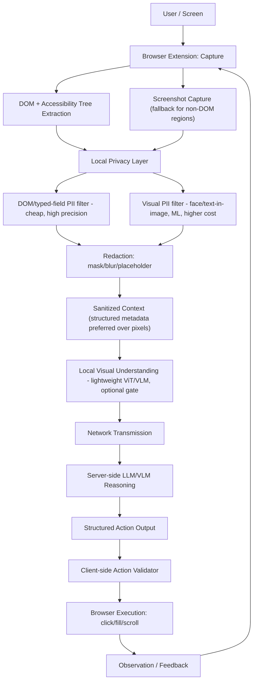

# System Architecture

Source: research doc §40–41 (Existing Architecture Analysis and
Evidence-Grounded Architecture), synthesizing §8–§32.

## Full pipeline

Every arrow is a real data/control flow, not decorative. No block is skipped
in the MVP except where a doc below says a block is gated (e.g. block D only
fires when DOM cannot describe a region; block H is the subject of the
DOM-gated-vs-unconditional experiment itself).

## Component evidence status

| Block | Evidence tag | Status |
|---|---|---|
| A–D: Capture, DOM/accessibility extraction, screenshot fallback | `[B][TECH-DOC]` | Standard browser APIs, well-documented |
| E1: DOM/typed-field PII filter | `[B][TECH-DOC]`+`[C]` | Zero-inference-cost, near-certain for correctly-typed fields |
| E2: Visual PII filter | `[C]`, `[A]` Rows 2–3 for redaction choice | Needs its own model + benchmark |
| F: Redaction | `[A]` Rows 2–3 (irreversible-by-design) | Design settled, implementation pending |
| G: Sanitized context | `[D]`, §29, §45.2 | Design settled, is the flagship novelty claim (#2) |
| H: Local visual understanding | `[A]` Row 1 (cost), `[C]` (model class), `[F]` (no in-browser benchmark exists) | Core experiment — see `docs/EXPERIMENT_PLAN.md` |
| I: Network transmission | `[D]` | TLS assumed baseline, not a research question |
| J: Server reasoning | Out of scope for this repo's client-side claims | Team's model choice, not yet made |
| K: Structured action output | `[D]`, §32 | Schema defined, see `docs/ACTION_PROTOCOL.md` |
| L: Client-side action validator | `[A]` Row 4 (94.4% injection success rate motivates this) | Mandatory, non-negotiable — see `docs/ACTION_VALIDATOR.md` |
| M–N: Execution, observation | `[D]` | Standard extension APIs |

## System boundaries

- **Client (browser extension):** owns blocks A–H and L–N. This is the
  enforcement point for privacy and for action safety — the server is never
  trusted to self-police either.
- **Server:** owns blocks I–K only (network receipt, reasoning, structured
  action emission). Never executes actions directly, never intentionally
  receives raw sensitive data.

## Runtime architecture notes (`[TECH-DOC]`, research doc §42)

- Manifest V3 (Chrome primary): background logic runs as a service worker,
  not a persistent background page; offscreen documents are likely needed
  for some capture/inference APIs — confirm WebGPU reachability from the
  intended extension context (content script vs. offscreen document) early,
  this is a known MV3 friction point.
- Firefox: best-effort via WebExtensions + WASM fallback path; WebGPU support
  should be assumed partial for a live-judged demo.

## Failure flow

See `docs/FALLBACK_STRATEGY.md` for the full WebGPU → WASM → DOM-only →
safe-failure chain and the hard rule: a privacy-layer failure must result in
**do not send**, never in falling back to raw data transmission.

## Security boundary

See `docs/PRIVACY_ARCHITECTURE.md` (what never/may leave the device) and
`docs/ACTION_VALIDATOR.md` (why model output is never treated as authority).

## What is explicitly not proven yet

Whether gating block H behind blocks C/E1 (DOM-first) actually reduces
end-to-end latency and/or improves accuracy versus running vision
unconditionally. This is the single most important early experiment — see
`docs/EXPERIMENT_PLAN.md`.
