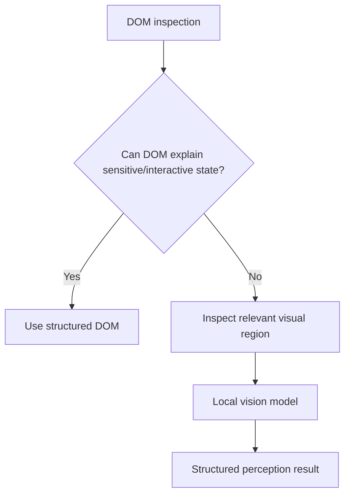

# Vision Pipeline

Source: research doc §8–17, §36, §42 technology matrix, §45.1.

## The vision model is not invoked unconditionally

This DOM-gating is the flagship experiment of the project: benchmark **(A)
unconditional vision invocation** against **(B) DOM-gated vision
invocation**, and report actual latency and PII-recall trade-offs on our own
test set. No such comparison currently exists in the literature at any
evidence tier (`[F]`, §45.1) — this is novelty claim #1 in
`docs/MASTER_CONTEXT.md`.

## What is `[A]`-supported

In-browser inference is measurably, substantially slower than native
inference across both CPU and GPU paths, with high device-to-device
variance: one journal study measured **16.9× (CPU) and 30.6× (GPU) average
slowdown** vs. native inference on PC, with device-dependent variance up to
28.4×/19.4× (Zhang et al. 2024, ACM TOSEM — research doc §7a Row 1, §12).
This is the single strongest piece of direct evidence for the
resource/latency evaluation criteria, and the reason the entire architecture
is designed to minimize what runs as an ML model in-browser.

## What is `[TECH-DOC]` (Chrome DevRel / W3C WebGPU / ONNX Runtime Web / Transformers.js docs)

- WebGPU: low-level GPU compute in current Chrome/Edge; Firefox/Safari
  support has trailed — assume **partial** for a live-judged demo, a WASM
  fallback is not optional.
- WebAssembly + SIMD: near-native CPU throughput, universally supported —
  the safe, portable default.
- Transformers.js wraps ONNX Runtime Web and ships browser-ready quantized
  (INT8/UINT8) small vision/VLM checkpoints — the most direct on-ramp given
  limited team time.
- Models must be quantized and served as ONNX; raw PyTorch checkpoints do
  not run in-browser.

`[D]` Runtime decision: **WASM default, WebGPU opportunistic** — feature-detect
and upgrade when available, never require it.

## Model candidates (none selected/downloaded/benchmarked yet)

| Class | Role | Evidence status |
|---|---|---|
| MobileViT/EfficientViT-class, 5–25M params, INT8, ONNX | Primary on-device vision model, Must Have | `[C]` — reasoned extrapolation from conference-literature model sizes/latencies + the Row 1 browser-overhead multiplier; **not proven by a journal paper for this exact task** |
| SmolVLM/MiniCPM-V-class local VLM | Should Have / stretch goal, the strongest available novelty bet | `[F]` — no browser-specific (as opposed to mobile-app or edge-server) deployment evidence found in the literature; must be attempted and its outcome documented either way, a documented failure is a valid result |

No journal (or, frankly, rigorous conference) paper was found benchmarking a
small VLM actually running via WebGPU inside a browser extension end-to-end —
this is a legitimate literature-confirmed novelty opportunity, closer to a
research contribution than an implementation detail (§8–17).

## Quantization

`[TECH-DOC]`: INT8 is the standard, essentially mandatory baseline for
ONNX Runtime Web/Transformers.js deployment of any vision model above a few
million parameters. INT4/pruning exist in principle but have materially
weaker browser-runtime tooling as of the research review — `[C]` recommend
INT8 as the MVP target, INT4 as a stretch goal explicitly requiring runtime
support validation before committing (§36).

## What must be experimentally validated (not assumed)

Everything in this document about actual latency numbers is a hypothesis
until benchmarked on real target hardware, both WASM and WebGPU paths. See
`docs/EXPERIMENT_PLAN.md` and `docs/LATENCY_AND_RESOURCE_MODEL.md`.
